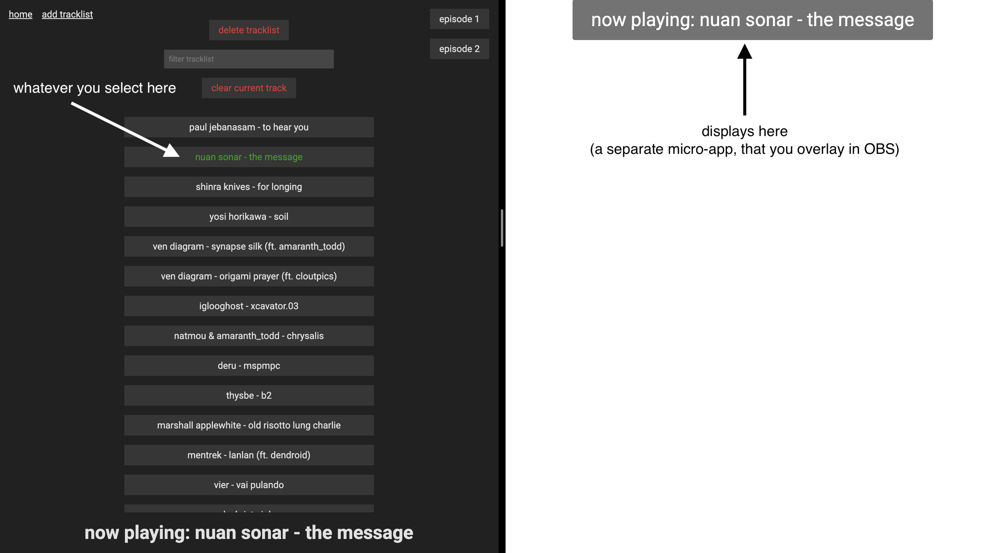

# nowplaying

a simple application for displaying track titles in OBS.

## how it works

there are two components - one application you interact with to manage track lists and select the currently playing track, and a second (very simple) one that displays the currently playing track, which is intended to be used as a browser source overlay in OBS.

you can run both on the same machine (that you are streaming from), but it is designed to work over a local network, such that you can display the track on one machine and manage the currently playing track on another. i use it in this fashion - the "streaming machine" runs the application, and i access it remotely from a separate laptop in the dj booth.

tracklists are stored as simple json files locally. for now you cannot edit them (unless you do so manually), only add or remove them. i will maybe add editing, but for now this is mostly for my personal use. PRs are welcome.

## starting and accessing the apps

from the root of this project, run `npm run dev` or `npm run start` to run both backend and frontend applications. by default the frontend application runs on port `3001` and the server runs on port `3000`.

## how to use in OBS

add a Browser media source to your scene, select `local file`, and select `OBS.html`. configure whatever size you want, and that's it!

## configuration

there are a few things you can tweak (within `OBS.html`):

- `DISPLAY_PREFIX`
  - this gets prepended to the track title
  - default is `now playing:`
- `FETCH INTERVAL`
  - how quickly the code checks for a new track
  - default is `1000`ms
- `CSS_TRANSITION_TIME`
  - how long the fade in/out animations last
  - default is `500`ms
  - note: this is set in as a _CSS variable_, not a JS variable
    - see `--fade-duration` within the `<style>` tag
- `ENABLE_GLITCH_EFFECT`
  - does what it says on the can
  - set the value to `false` to turn it off

beyond that, simply update the css if you want to change font, size, colors, etc.

### customizing ports

if you want to change the ports:

- you can change the default port for the frontend application by adding an `.env` file in the `frontend` directory and populating a `VITE_SERVER_BASE_URL` variable with your chosen port
- the backend port (for now) must be changed by editing the `port` variable
